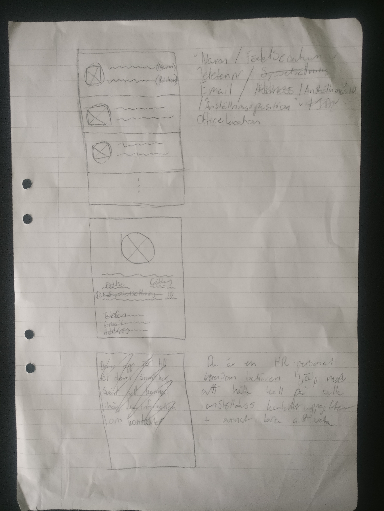
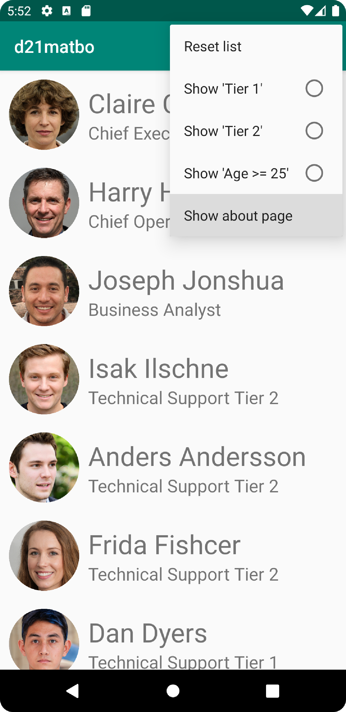
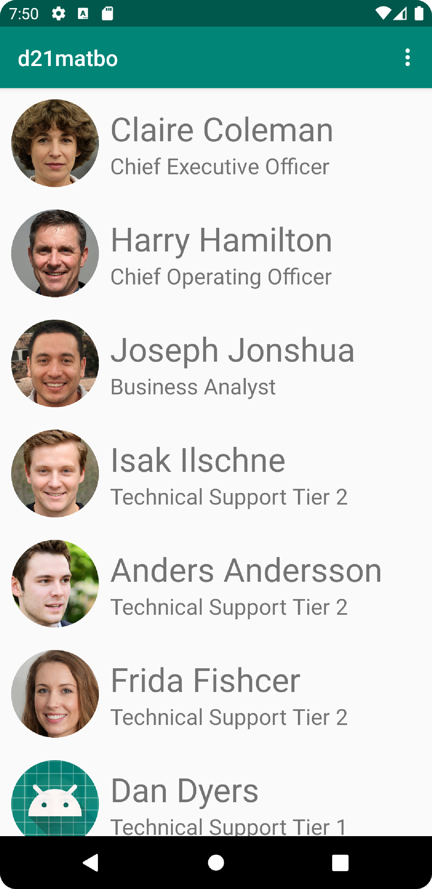
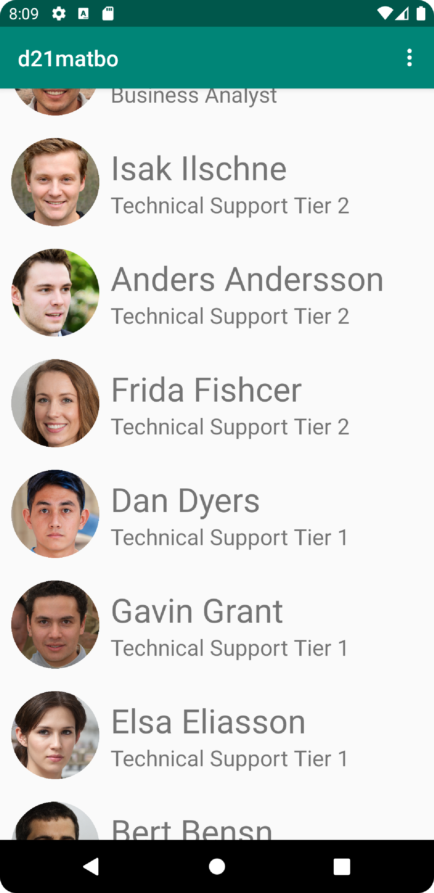
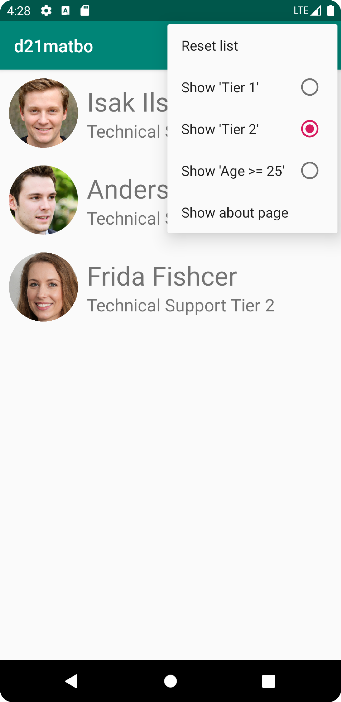
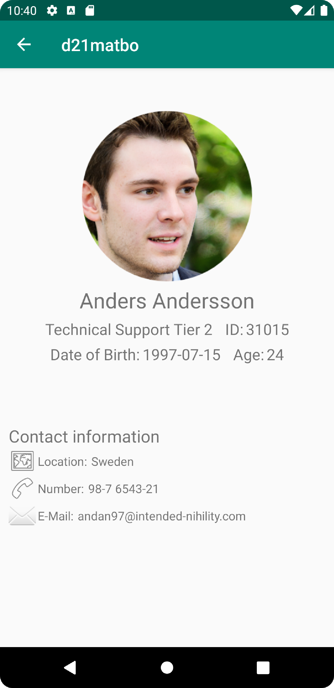

# Project Report
## Sketch / Design
Below is the sketch for the application, it was created in the beginning and has pretty much stayed true until the end.
There exist only some minor differences in what data the application manages and in the about-page.

*Image 1: Sketch showing the layout of the screens in order; 1st Main page, 2nd Detailed View & 3rd About page.*
## Web Service
The application is retrieving its data from the internet using the provided webservice combined with JSON.
The JSON data that is retrieved contain multiple objects that represents each employee and one of those objects look like this:
```json
{
	"ID": "d21matbo_31015",
	"name": "Anders Andersson",
	"type": "d21matbo",
	"company": "Technical Support Tier 2",
	"location": "Sweden",
	"category": "andan97@intended-nihility.com",
	"size": 31015,
	"cost": 987654321,
	"auxdata": {
		"dob": {
			"dateOfBirth": 19970715
		},
		"imageURL": "https://i.imgur.com/XFqJVnY.png"
	}
}
```
*Code block 1: JSON-Object (prettified)*

**All JSON-data is fictional and images used are [AI-generated](https://this-person-does-not-exist.com/en).**
 - `name` Represents the name of the employee, both first and last name.
 - `company` Represents their title in the company.
 - `location` Represents where in the world they work from.
 - `category` Represents their company email.
 - `size` Represents their employment id, the same number combined with `type` is used for
   `ID` since it is unique
 - `cost` Represents their company phone number.
 - `auxdata` Represents both their date of birth and the link to their
   profile picture.

## Implementation Examples
### Example 1 - Show about page
```java
public boolean onOptionsItemSelected(@NonNull MenuItem item) {
	switch (item.getItemId()) {
	case R.id.action_about:
		Intent intent = new Intent(this, AboutActivity.class);
		startActivity(intent);
		return true;
	case...
	}
}
```
*Code block 2: Part of onOptionsItemSelected in MainActivity.java*

This method is called when the user press a menu item in the toolbar and it provides a reference to the pressed item.
With the reference it is possible to retrieve its id by using `item.getItemId()`
which can be used in the switch statement to execute the correct code.
When the user press the menu item "Show about page" with the id `action_about` the block of code inside `case R.id.action_about` is executed.
Since the about page should be displayed in another activity it is started by the method `startActivity(intent)`.

The code was moved inside the switch statement [here](https://github.com/d21matbo/mobileapp-programming-project/commit/f3b0c0944a658bc394adea2b3f200e29d2e9fddc)
to clean it up and provide room for additional menu items (see Image 2).


*Image 2: Show about page pressed*

### Example 2 - Load and Present JSON-data
This application uses the provided [JsonTask](https://github.com/LenaSYS/mobileapp-programming-networking/blob/master/app/src/main/java/com/example/networking/JsonTask.java)
class to retrieve JSON-data from the internet, specifically from [JSON_URL](https://mobprog.webug.se/json-api?login=d21matbo).
By implementing `JsonTask.JsonTaskListener` in `MainActivity.java` the following line of code can be executed.
```java
new JsonTask(this).execute(JSON_URL);
```
*Code block 3: Imported class method*

This line of code is executed on two different places, once in `onCreate` and once in `onCreateOptionsMenu`.
During the development of the application [the method](https://github.com/d21matbo/mobileapp-programming-project/commit/64e7a05e674eb767de461784947e0dccae69c18e)
was using a local .json file instead for testing purposes.
Both methods are asynchronous which means that they are working on their own thread separately from the main thread and when they are done the following method is called.
```java
public void onPostExecute(String json) {
	if (json != null) {
		Gson gson = new Gson();
		Type type = new TypeToken<List<Employee>>(){}.getType();
		ArrayList<Employee> fetchedList = gson.fromJson(json, type);
		updateEmployees(fetchedList);
	}
}
```
*Code block 4: onPostExecute in MainActivity.java*

This method starts by doing a "null-check" on the provided string `json`,
this is done so that the code inside the block never works with null-values.
Then the imported library `Gson` is used to create objects from the provided `json` and put them inside a list
`ArrayList<Employee> fetchedList = gson.fromJson(json, type);`
which is then added to the adapter that displays each object inside the recycler view (see Image 3).

*Image 3: Loading JSON-data*

### Example 3 - Main activity RecyclerView
The RecyclerView is added to `activity_main.xml` which is the XML document that creates the layout for the main activity.
The document already contained code that creates a toolbar, unfortunately this toolbar is not really working with the parent constraint layout.
The issue was fixed [here](https://github.com/d21matbo/mobileapp-programming-project/commit/41d04269177d39167f4d0e7ebcd2ac1814503be4)
and before the fix the RecyclerViews' top was partially hidden under the toolbar.
```xml
<androidx.constraintlayout.widget.ConstraintLayout
	...
    <androidx.recyclerview.widget.RecyclerView
        android:id="@+id/recycler_view"
        android:layout_width="match_parent"
        android:layout_height="match_parent"
        app:layout_constraintBottom_toBottomOf="parent"
        app:layout_constraintEnd_toEndOf="parent"
        app:layout_constraintStart_toStartOf="parent"
        app:layout_constraintTop_toTopOf="parent"
        android:layout_marginTop="?attr/actionBarSize"/>
</androidx.constraintlayout.widget.ConstraintLayout>
```
*Code block 4: XML RecyclerView component*

This is the xml code that creates a RecyclerView in `activity_main.xml`, it provides the component with an id, size and constraints.
The line `android:layout_marginTop="?attr/actionBarSize"` pushes the RecyclerView down from the top
exactly the amount of pixels needed so that it is no longer partially hidden under the toolbar.
This works since the margin is the specified `android:layout_height` of the toolbar.
The result can be seen in Image 3 as the first employee in the list is fully visible.


*Image 4: Scrolling through RecyclerView*

## Implementation Examples (VG)
### Example 1 - Filter data shown in RecyclerView
The solutions for the requirement to filter what data shows and its sub-requirement to be able to save
the filter goes hand in hand even though they are solved through different functionalities.
The filtering is done using an SQLite database and querying against it,
and the saving of the filter is done using SharedPreferences.
```java
private void readSQLData() {
    @SuppressLint("Recycle")
    Cursor cursor = databaseHelper.getReadableDatabase().rawQuery(
		preferences.getString("querySQL", DatabaseTable.SQL_SELECT_ALL), null, null
        );
    List<Employee> fetchedList = new ArrayList<>();
    while (cursor.moveToNext()) {
		fetchedList.add(new Employee(...));
	}
    updateEmployees(fetchedList);
}
```
*Code block 5: readSQLData in MainActivity.java*

The most important part of this [method](https://github.com/d21matbo/mobileapp-programming-project/commit/88330fe3a7dfbe953e902df3a2faa9fbdb97dbd5)
is the line `preferences.getString("querySQL", DatabaseTable.SQL_SELECT_ALL)` since it decides what query is sent to the database
i.e. decides what employees to select.
The information from the selected employees is then used to create objects and pass them to the RecyclerViews' adapter.
The code works by accessing the SharedPreference named `querySQL` which holds the SQL select statement or defaults to `DatabaseTable.SQL_SELECT_ALL`.

SharedPreferences provides permanent storage of key-value pairs,
so if the user would restart the application,
`readSQLData()` would be called in `onCreate()` in `MainActivity.java` and the filtering would still be the same as the last time.

The preference is written to i.e. the filter changes,
when the user click any of the menu items that is not "Show about page" (see Image 5)
and an indicator is added/removed to show the user what is currently being filtered.


*Image 5: Showing filtering function*

### Example 2 - Detailed view
Clicking any of the items in the RecyclerView list changes the screen to a more detailed activity of the pressed item (see Image 6?).
This functionality have been touched and modified multiple times,
but the biggest change happened [here](https://github.com/d21matbo/mobileapp-programming-project/commit/a5d00309c397848428de9c1485570d6bfd29cb12)
where the functionality was put inside its own class `ProjectOnClickListener.java`.
The class is instantiated inside the adapters' constructor and kept as a class variable.
```java
public ProjectViewHolder onCreateViewHolder(@NonNull ViewGroup parent, int viewType) {
	View view = LayoutInflater.from(parent.getContext()).inflate(R.layout.list_item, parent, false);
    view.setOnClickListener(onClickListener);
    return new ProjectViewHolder(view);
}
```
*Code block 6: onCreateViewHolder in ProjectAdapter.java*

The method `onCreateViewHolder` is used to create the items that is displayed by the RecyclerView.
Once a item is "inflated" the line `view.setOnClickListener(onClickListener);`
adds the one instance of `ProjectOnClickListener` to it.
By doing this, each item in the RecyclerView has the same generic onClickListener.

To solve the issues that follows a generic onClickListener,
it needs to be able to differentiate which item was clicked and get the position of said item so it
can access the right object in the array storing all employee objects.
```java
public void onClick(View view) {
    RecyclerView recyclerView = (RecyclerView) view.getParent();
    sendIntent(recyclerView, recyclerView.getChildAdapterPosition(view));
}
```
*Code block 7: onClick in ProjectOnClickListener*

This method is called once a view in the RecyclerView is clicked and it does provide a reference to that view.
Unfortunately the class `View` does not have a position attribute, which is one of the things needed.
`RecyclerView recyclerView = (RecyclerView) view.getParent();` provides a reference to this views' parent,
this is done since the class `RecyclerView` has the method `getChildAdapterPosition(view)`
that returns the position of the provided view.
The reference to the recyclerView and the views' position is then passed as arguments to the method
`private void sendIntent(RecyclerView recyclerView, int position) {...}`
which proceeds to extract all information from the right employee and starts the detailed activity.


*Image 6: Detailed view of "Anders Andersson"*

## Reflection
I think that in its core this project was a little to easy for me, although nothing stopped me from making it harder for myself.
I really enjoyed the openness of the assignment since it allowed me to push my knowledge and experience further.
I have had zero experience in developing applications before this course,
but i believe that my previous coding knowledge combined with my experience with other powerful IDEs helped me a lot along the way.

The previous assignments in this course laid a great foundation for the project with both knowledge and reusable code,
that could be built upon.
For example some of the additional features required some tinkering and problem solving,
which I personally enjoyed a lot.

>Overall a great assignment.